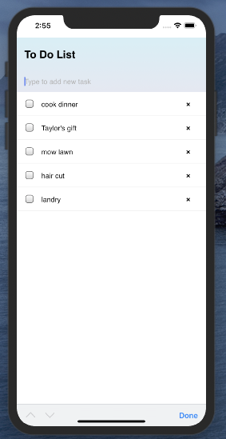
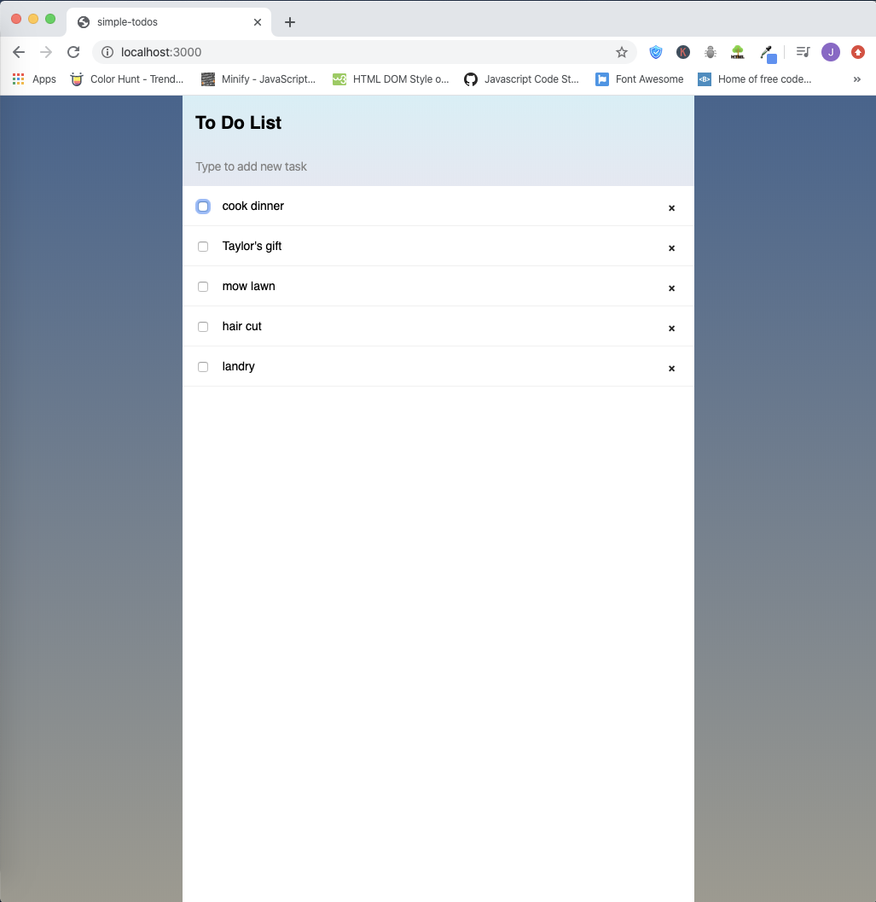

# MEBN-Stack-To-Do-List

## Challenges I Faced? 

Seeing that I've only worked with react, I don't know what it would be like branching out to other JavaScript platforms, So as of right now he might be too early to say exactly what my challenges consist of because working with the stack at this point is more or less a mystery rather than a puzzle. 

## How Did I Over Come Those Challenges?

While doing the tutorial things became a little more clear, and building meteor applications with Blaze JS seems to be a lot simpler than React and a lot faster as well. I'll need to work with it more and more to feel comfortable but I do like this stack, seems like a lot of the heavy lifting is already done. 

## What Did I Learn? 

* Basics of setting up a meteor application 
* Basics of defining views with templates within a meteor  application
* Using collections to store persistent data within a meteor application
* Mongo DB basics
* Blaze.js basics
* How to run a meteor application on an iOS simulator

